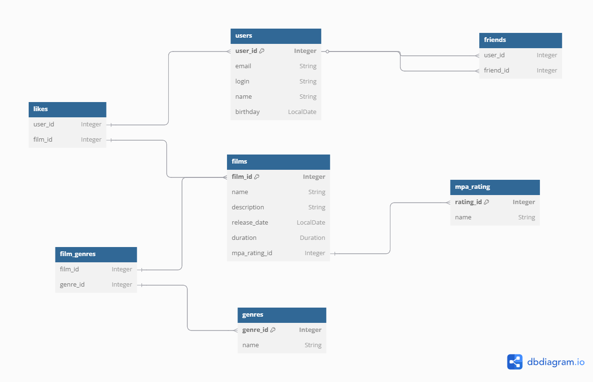

Схема базы данных

Описание схемы

users — таблица пользователей;

films — фильмы с описанием, датой выхода, длительностью и возрастным рейтингом;

likes — лайки пользователей к фильмам (многие ко многим);

friends — дружеские связи между пользователями.

Table friends {
user_id Integer
friend_id Integer
status friendship_status
}

Enum friendship_status {
PENDING
CONFIRMED
}

Enum mpaRating {
G
PG
PG_13
R
NC_17
}

Enum genre {
COMEDY
DRAMA
ANIMATION
THRILLER
DOCUMENTARY
ACTION
}

Table users {
user_id Integer [primary key]
email String
login String
name String
birthday LocalDate
}

Table likes {
user_id Integer
film_id Integer
}

Table films {
film_id Integer [primary key]
name String
description String
release_date LocalDate
duration Duration
genres genre
MPA mpaRating
}

Ref: likes.user_id < users.user_id

Ref: likes.film_id < films.film_id

Ref: users.user_id < friends.user_id

Ref: users.user_id < friends.friend_id
