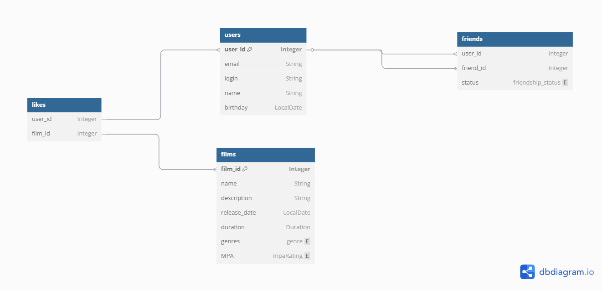

Схема базы данных

Описание схемы

users — таблица пользователей;

films — фильмы с описанием, датой выхода, длительностью и возрастным рейтингом;

genres и film_genres — жанры и их связь с фильмами (многие ко многим);

mpa_rating — справочник возрастных рейтингов (G, PG и т.д.);

likes — лайки пользователей к фильмам (многие ко многим);

friends — дружеские связи между пользователями.

